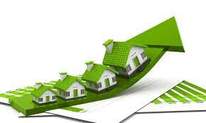

# Home Sales Predictions

## Goals
1. Use SparkSQL to determine key metrics about home sales data. 
2. Use Spark to create temporary views, partition the data, cache and uncache a temporary table, and verify that the table has been uncached.
   

**The following questions were answered using SparkSQL:**

a. What is the average price for a four-bedroom house sold for each year? Round off your answer to two decimal places.

|2022|    $296363.88|

|2021|    $301819.44|

|2020|    $298353.78|

|2019|     $300263.7|

b. What is the average price of a home for each year it was built that has three bedrooms and three bathrooms? Round off your answer to two decimal places.

|2017|    $292676.79|

|2016|    $290555.07|

|2015|     $288770.3|

|2014|    $290852.27|

|2013|    $295962.27|

|2012|    $293683.19|

|2011|    $291117.47|

|2010|    $292859.62|

c. What is the average price of a home for each year that has three bedrooms, three bathrooms, two floors, and is greater than or equal to 2,000 square feet? Round off your answer to two decimal places.

|2017|    292676.79|

|2016|    290555.07|

|2015|     288770.3|

|2014|    290852.27|

|2013|    295962.27|

|2012|    293683.19|

|2011|    291117.47|

|2010|    292859.62|

d. What is the "view" rating for homes costing more than or equal to $350,000? Determine the run time for this query, and round off your answer to two decimal places.

|  99|   1061201.42|

|  98|   1053739.33|

|  97|   1129040.15|

|  96|   1017815.92|

|  95|    1054325.6|

|  94|    1033536.2|

|  93|   1026006.06|

|  92|    970402.55|

|  91|   1137372.73|

|  90|   1062654.16|

|  89|   1107839.15|

|  88|   1031719.35|

|  87|    1072285.2|

|  86|   1070444.25|

|  85|   1056336.74|

|  84|   1117233.13|

|  83|   1033965.93|

|  82|    1063498.0|

|  81|   1053472.79|

|  80|    991767.38|

